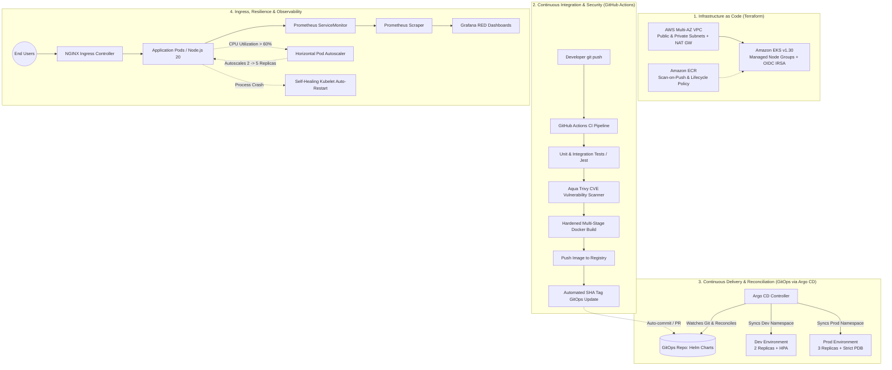

# Enterprise Kubernetes Platform Engineering & GitOps System

[](https://kubernetes.io/)
[](https://www.terraform.io/)
[](https://argoproj.github.io/cd/)
[](https://prometheus.io/)
[](https://grafana.com/)
[](https://trivy.dev/)
[](https://www.docker.com/)

An end-to-end, production-grade cloud platform engineered with a modern GitOps delivery model, automated Infrastructure as Code (IaC), DevSecOps vulnerability gating, dynamic autoscaling, and Google SRE Golden Signal observability.

This repository serves as the **declarative single source of truth and control plane** for the entire platform.

---

## 🏛️ Architecture Overview



---

## 📦 The 3-Tier Platform Ecosystem

The platform is architected into three decoupled, single-responsibility repositories:

| Repository | GitHub Link | Purpose & Tech Stack |
| :--- | :--- | :--- |
| **Declarative GitOps (This Repo)** | [kubernetes-platform-gitops](https://github.com/PandaVerse09/kubernetes-platform-gitops) | Parameterized Helm v3 charts, environment values (`dev` & `prod`), Argo CD Application manifests, PDB, HPA, NetworkPolicies, and Prometheus stack configuration. |
| **Microservice Application** | [kubernetes-platform-app](https://github.com/PandaVerse09/kubernetes-platform-app) | Node.js 20 REST API, Liveness/Readiness probes, Prometheus RED metrics, Chaos testing endpoints, multi-stage non-root Dockerfile, and GitHub Actions CI. |
| **Cloud Infrastructure (IaC)** | [kubernetes-platform-infra](https://github.com/PandaVerse09/kubernetes-platform-infra) | Modular Terraform configurations for AWS VPC (multi-AZ, NAT Gateways), ECR with CVE scanning, and AWS EKS v1.30 managed cluster with OIDC for IAM Roles for Service Accounts (IRSA). |

---

## 📂 Repository Structure

```text
kubernetes-platform-gitops/
├── argocd/
│   ├── application-dev.yaml      # Argo CD Application manifest for Dev
│   └── application-prod.yaml     # Argo CD Application manifest for Prod
├── charts/
│   └── application/              # Reusable Helm v3 templates
│       ├── Chart.yaml
│       ├── values.yaml           # Base defaults
│       └── templates/            # Deployment, Service, Ingress, HPA, PDB, NetworkPolicy, ServiceMonitor
├── environments/
│   ├── dev/values.yaml           # Local cluster overrides (2 replicas, HPA, localhost ingress)
│   └── prod/values.yaml          # Production overrides (3 replicas, strict PDB, 70% HPA)
├── monitoring/
│   └── values-prometheus.yaml    # Helm values for Prometheus Operator + Grafana
└── kind-config.yaml              # Multi-port KIND cluster definition
```

---

## 🛡️ Key Enterprise Highlights

### 1. Shift-Left Security & Hardening
- **Vulnerability Scanning**: Automated Aqua Trivy static analysis scans container images for OS and application CVEs before push.
- **Non-Root Runtime**: Containers execute under a dedicated unprivileged user (`node:node`) with minimized attack surface based on Alpine Linux.
- **Zero-Trust Network Isolation**: Kubernetes `NetworkPolicy` objects restrict ingress traffic strictly to the application port and authorized namespaces.

### 2. Declarative GitOps Workflow
- **Single Source of Truth**: Cluster state is 100% defined in Git. No engineer or operator has manual write access (`kubectl apply`) to cluster state in production.
- **Drift Detection & Self-Healing**: Argo CD reconciles any unauthorized out-of-band changes back to the declared Git state within seconds.
- **Multi-Environment Promotion**: Independent environment configurations for `dev` (lightweight, rapid iteration) and `prod` (high availability with Pod Disruption Budgets and higher autoscaling limits).

### 3. High Availability & Resilience
- **Zero-Downtime Deployments**: Rolling updates managed via Kubernetes Deployment controllers paired with Pod Disruption Budgets (`minAvailable: 2`).
- **Dynamic Horizontal Autoscaling**: Kubernetes HPA dynamically provisions additional replicas (up to 5 in Dev, 10 in Prod) when synthetic or organic CPU thresholds exceed target utilization.
- **Autonomous Self-Healing**: Active `/health` (Liveness) and `/ready` (Readiness) probes ensure traffic is instantly routed away from failing containers while kubelet restarts the crashed instance.

### 4. SRE & Golden Signal Observability
- **RED Methodology**: Native instrumentation exposing Request Rate, Error counts, and Duration histograms (`http_request_duration_seconds`).
- **ServiceMonitor Integration**: Prometheus Operator automatically discovers endpoints and scrapes metrics every 15 seconds.
- **Centralized Dashboards**: Pre-integrated Grafana for real-time visualization of container resource saturation, network I/O, and HTTP request throughput.

---

## 🖥️ Live Platform Dashboard Access

All platform services are actively running and accessible on `localhost`:

| Service | Local URL | Credentials / Notes |
| :--- | :--- | :--- |
| **Application Web Dashboard** | [http://localhost/](http://localhost/) | Interactive UI showing real-time Pod telemetry, Chaos Lab buttons, and CRUD manager. |
| **Argo CD Web UI** | [https://localhost:8081](https://localhost:8081) | User: `admin` • Password: `DsvwQNYO9FB5p670` *(Accept self-signed SSL warning)* |
| **Grafana Monitoring** | [http://localhost:3000](http://localhost:3000) | User: `admin` • Password: `prom-operator` |
| **Prometheus Raw Metrics** | [http://localhost/metrics](http://localhost/metrics) | Scraped RED metrics exposed by the microservice. |
| **Liveness Probe** | [http://localhost/health](http://localhost/health) | Kubernetes liveness probe check. |

---

## 🎯 Live Demonstration Runbook

### Scenario A: Zero-Downtime Self-Healing (Chaos Test)
1. Open the [Argo CD UI](https://localhost:8081) and navigate to `kubernetes-platform-app-dev`.
2. Open the [App Dashboard](http://localhost/) and click **"Simulate Fatal Crash"** (or run `curl.exe -X POST http://localhost/api/v1/admin/crash`).
3. **Observe**: One pod exits; the second pod takes 100% of user traffic with zero downtime; Kubernetes instantly respawns a replacement pod.

### Scenario B: Dynamic Horizontal Autoscaling (HPA)
1. In the [App Dashboard](http://localhost/), click **"Burn CPU (Trigger HPA Autoscaler)"** multiple times.
2. In PowerShell, monitor the autoscaler: `kubectl get hpa -n dev -w`.
3. **Observe**: CPU spikes above the 60% threshold; Kubernetes HPA scales the deployment out from **2 pods ➔ 3 pods ➔ 5 pods** in real-time.

### Scenario C: GitOps Continuous Delivery
1. Make any configuration change in this repository (e.g., replica count or resource limits) and run `git push`.
2. **Observe**: Argo CD detects the Git commit hash, transitions to `Progressing`, and executes an automated rolling update.

---

## 🚀 Quick Start (Local Setup)

```bash
# 1. Create multi-port cluster
kind create cluster --config kind-config.yaml --name devops-cluster

# 2. Install NGINX Ingress Controller
kubectl apply -f https://raw.githubusercontent.com/kubernetes/ingress-nginx/main/deploy/static/provider/kind/deploy.yaml

# 3. Install Argo CD
kubectl create namespace argocd
kubectl apply -n argocd -f https://raw.githubusercontent.com/argoproj/argo-cd/stable/manifests/install.yaml

# 4. Deploy Dev & Prod via GitOps
kubectl apply -f argocd/application-dev.yaml
kubectl apply -f argocd/application-prod.yaml
```

---

## 👤 Author
**PandaVerse09** • DevOps & Platform Engineering Lab
